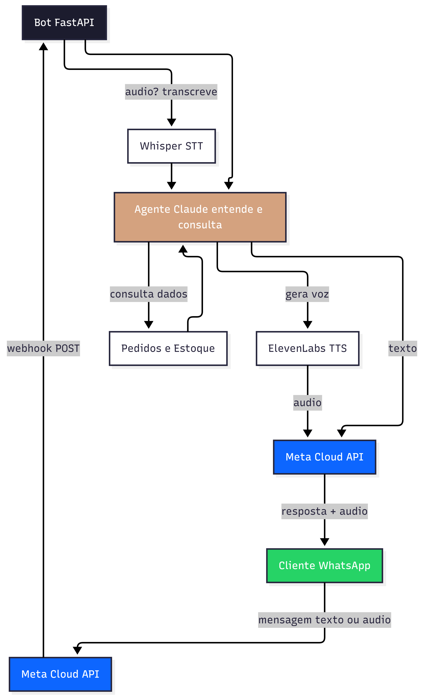
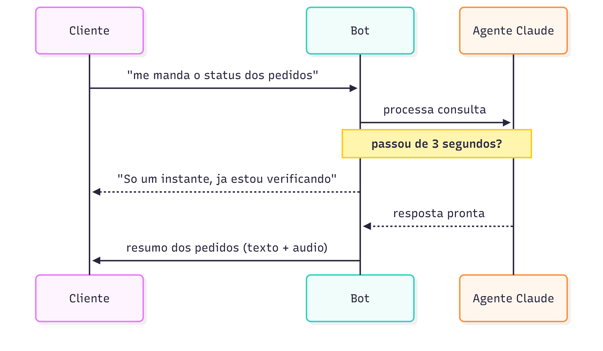
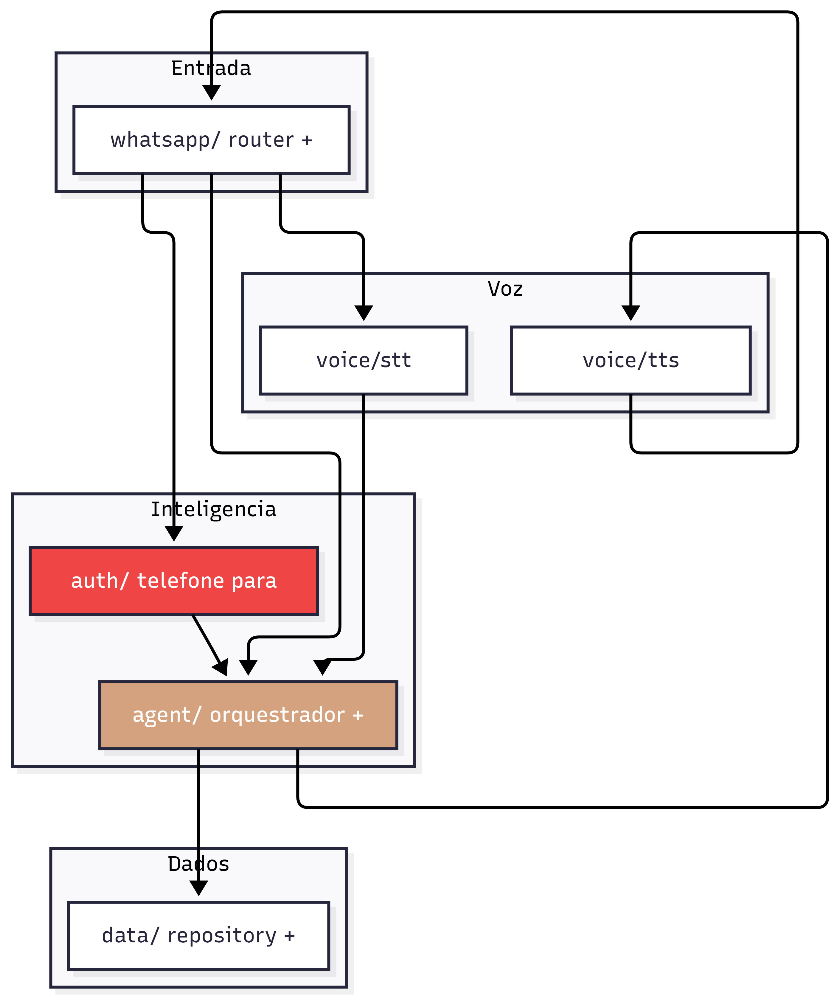

# Atendente Comercial AMC — Chatbot B2B no WhatsApp

Assistente de **atendimento comercial B2B** da AMC Têxtil que conversa com lojistas e
compradores pelo **WhatsApp** e responde, em **texto e áudio**, sobre **pedidos** e
**disponibilidade de estoque** — entendendo a pergunta em linguagem natural, sem menus
nem formulários.

---

## O que ele faz

- **Atende no WhatsApp, a qualquer hora, sem fila.** O cliente manda a mensagem e é
  respondido na hora, como numa conversa normal.
- **Entende linguagem natural — por escrito ou por voz.** O cliente pode digitar ou
  **mandar uma mensagem de voz**; o assistente entende as duas formas.
- **Responde também por voz.** Além do texto, o assistente **responde com áudio**, para
  uma conversa mais natural.
- **Consulta pedidos e estoque.** Status e prazo de um pedido, e se um produto está
  disponível para comprar.
- **Não deixa o cliente no vácuo.** Quando a consulta demora um pouco, ele avisa
  *"só um instante, já estou verificando"* antes de trazer a resposta.
- **Cada cliente vê só os próprios dados.** Uma conta nunca enxerga pedidos ou
  informações de outra (isolamento por segurança).
- **Não executa ações sozinho.** Pedidos de cancelamento ou de compra não são
  executados: o assistente **registra a solicitação e encaminha** ao time, avisando o
  cliente de que o time retorna.



Quando a resposta exige uma consulta mais demorada, o cliente recebe um aviso
intermediário para não ficar esperando em silêncio:



---

## Como funciona

O cliente fala pelo WhatsApp; a mensagem chega ao nosso serviço pela **API oficial do
WhatsApp (Meta)**. Se for áudio, ele é **transcrito** para texto; um modelo de
linguagem **(Claude)** interpreta o pedido e, quando precisa de um dado real (pedido,
prazo, estoque), o **código** — não o modelo — consulta a base e devolve o fato. A
resposta volta em texto e, em paralelo, é convertida em **áudio**.



**Stack:** WhatsApp Cloud API (Meta/Graph) · Claude (Anthropic) · Whisper/OpenAI (voz →
texto) · ElevenLabs (texto → voz) · PostgreSQL · FastAPI (Python 3.12).

**Sobre os dados (transparência):** o **catálogo de produtos é real** — itens da
**Colcci** (marca da própria AMC), obtidos via API VTEX. Já **clientes, pedidos e
estoque são sintéticos** (dados de demonstração). O assistente é **somente-leitura**:
não altera nada no sistema da AMC.

---

## Documentação técnica

> Fonte da verdade do produto: **`spec.md`**. Primer de cada sessão de
> desenvolvimento: **`CLAUDE.md`**.

### Portas reservadas (PORT-REGISTRY — não improvisar)

| Serviço     | host:container |
|-------------|----------------|
| FastAPI app | `8005:8000`    |
| PostgreSQL  | `5438:5432`    |

### Desenvolvimento local

Requer Python 3.12+.

```bash
python -m venv .venv && . .venv/Scripts/activate   # Windows: .venv\Scripts\Activate.ps1
pip install -r requirements-dev.txt
cp .env.example .env                                # preencher segredos

# Qualidade (mesma ordem do CI)
ruff check . && ruff format --check .
bandit -r app/
pip-audit -r requirements.txt
pytest                                              # cobertura mínima 70%
```

### Evals de comportamento (sob demanda, fora do CI)

As evals batem na Claude API real e medem o comportamento do modelo (lê número de volta?
recusa dado de outra conta? não inventa saldo?). Ritual e casos em **`EVALS.md`**.

```bash
pytest -m eval                 # precisa de ANTHROPIC_API_KEY no .env; sem ela, skipa
```

O CI roda só a suíte determinística (`-m "not eval"` no `addopts` do `pyproject.toml`).

### Subir com Docker (Postgres + app)

```bash
cp .env.example .env       # preencher segredos (Claude, OpenAI, ElevenLabs, WhatsApp)
docker compose up --build  # app em http://localhost:8005/health
```

Garanta que as portas **8005** (app) e **5438** (Postgres) estejam livres no host antes
de subir. O `DATABASE_URL` usa o nome do container (`cb_amc_comercial_db`), nunca
`localhost`. Rode com **`--workers 1`** — o histórico de conversa do MVP é em memória
(ver `spec.md` / `app/agent/orchestrator.py`).

Depois de subir, popular o banco e (opcional) cadastrar um cliente-demo — `scripts/` já
vai na imagem:

```bash
docker compose exec app python -m app.data.seed
docker compose exec app python -m scripts.cadastrar_demo --telefone "5547999998888" --nome "Boutique do João"
```

### Deploy na VPS (Traefik)

Na VPS, app e banco entram na rede Docker **externa** do Traefik
(`n8n-traefik_app_network`) para que o Traefik publique o app em
`https://bot.thiagoscutari.com.br` com TLS. Esse ajuste vive no overlay
**`docker-compose.vps.yml`**, aplicado SÓ na VPS com dois `-f`:

```bash
docker compose -f docker-compose.yml -f docker-compose.vps.yml up -d --build
```

O `docker-compose.yml` base é **dev-safe** (sem rede externa), então `docker compose up`
local continua funcionando. O overlay **não** é um `docker-compose.override.yml` de
propósito: o override seria auto-carregado e quebraria o `up` local (a rede externa não
existe na máquina de dev). A rede externa precisa existir antes na VPS
(`docker network ls`).

### Conectar o WhatsApp (Cloud API da Meta)

A integração é com a **WhatsApp Cloud API oficial** (Graph API) — **não há QR code**. O
mesmo path `/webhook/whatsapp` atende dois momentos:

1. **Verificação do webhook (GET).** No app da Meta, configure a *Callback URL*
   `https://bot.thiagoscutari.com.br/webhook/whatsapp` e o *Verify Token* igual a
   `WHATSAPP_VERIFY_TOKEN`. A Meta faz um GET com `hub.verify_token`/`hub.challenge`; o
   app confere o token e devolve o challenge.
2. **Recebimento de mensagens (POST).** A Meta envia os eventos em
   `entry[].changes[].value.messages[]`. Cada POST é autenticado pela assinatura
   `X-Hub-Signature-256` (HMAC-SHA256 do corpo com o `WHATSAPP_APP_SECRET`), validada
   antes de qualquer parse.

Para a Meta **entregar** mensagens, a conta WhatsApp Business (**WABA**) precisa estar
**inscrita no app** (`subscribed_apps`) — sem isso, o webhook nunca recebe nada. O envio
de respostas usa o **número da Meta** (`WHATSAPP_PHONE_NUMBER_ID`) e um **token
permanente** de System User (`WHATSAPP_ACCESS_TOKEN`).

Variáveis relevantes no `.env` (template em `.env.example`):

| Variável | Para quê |
|----------|----------|
| `WHATSAPP_PHONE_NUMBER_ID` | número virtual da Meta que envia/recebe |
| `WHATSAPP_ACCESS_TOKEN`    | token permanente (System User) |
| `WHATSAPP_VERIFY_TOKEN`    | string que você define; verificação do webhook (GET) |
| `WHATSAPP_APP_SECRET`      | valida a assinatura `X-Hub-Signature-256` (POST) |
| `WHATSAPP_API_VERSION`     | versão do Graph API (ex.: `v23.0`) |

> Migração: o projeto **nasceu sobre a Evolution API** (não-oficial) e **migrou para a
> Cloud API oficial da Meta**. As variáveis `EVOLUTION_*` permanecem apenas comentadas,
> como caminho de rollback — não fazem parte do fluxo atual.

#### Checklist de validação no host (o que os testes NÃO cobrem — exige número real)

- [ ] webhook verificado na Meta (GET com o `WHATSAPP_VERIFY_TOKEN` retorna o challenge)
- [ ] WABA inscrita no app (`subscribed_apps`) — mensagens chegando no `POST /webhook/whatsapp`
- [ ] enviar/receber **texto** num WhatsApp real (ida e volta)
- [ ] enviar **áudio**: a mensagem de voz é transcrita e o bot **responde com áudio**
- [ ] `DEMO_PHONE` (em `app/data/seed.py`) trocado pelo número real do cliente-demo
- [ ] **resumo visual:** mandar "meus pedidos" e confirmar que chega o documento
      `Resumo de Pedidos.html` e abre estilizado no navegador do celular — é aditivo: se
      falhar, a resposta em texto (lista de pedidos) sai do mesmo jeito
- [ ] domínio próprio + SSL válido (Traefik) ativos em `bot.thiagoscutari.com.br`

### Estrutura

```
.
├── app/
│   ├── agent/          # orquestrador (tool-use) + tools + system_prompt.md
│   ├── auth/           # telefone -> cliente_id (fail-closed)
│   ├── data/           # models, repository (filtro por cliente_id), seed, catálogo
│   ├── ops/            # escalonamento (fallback humano)
│   ├── report/         # resumo visual de pedidos em HTML (aditivo)
│   ├── voice/          # stt.py (Whisper) · tts.py (ElevenLabs) · fala.py (texto falável)
│   ├── whatsapp/       # client.py (Cloud API) · router.py (webhook+dispatcher) · factory.py
│   ├── config.py       # Pydantic Settings (segredos só no .env)
│   ├── logging_config.py
│   └── main.py         # FastAPI + /health + webhook
├── tests/              # suíte determinística + tests/evals/ (Claude API real)
├── docs/img/           # diagramas do README
├── Dockerfile · docker-compose.yml · docker-compose.vps.yml · requirements*.txt · pyproject.toml
├── EVALS.md            # gate de comportamento
├── spec.md · CLAUDE.md
└── .github/workflows/ci.yml
```

O build seguiu o `spec.md §14` — 1 commit atômico por fase, tag `[SNN]`.
